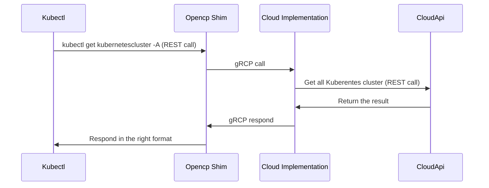

# Introduction

OpenCP is a project originally developed by Civo (www.civo.com) to create a single interface to manage infrastructure using a single tool kubectl, this project has 3 components:

- opencp-shim
- opencp-spec
- Provider implementation

## opencp-spec

`opencp-spec` is in charge of keeping the api in go and the client and server generated using `protobuf` files, which will then be used by `opencp-shim` and the provider implementation

## opencp-shim

`opencp-shim` is in charge of interfacing `kubectl` with the provider implementation, this project uses `opencp-spec` to import the `kubectl` compatible go api and create the `gRCP` client which then It will connect to the server created by the cloud provider.

## Provider Implemetation

The provider's implementation imports `opencv-spec` to create the gRCP server and at the same time talk to the provider's API to fetch the mobjects and convert them to `protobuf` objects.

## Open Control Plane Flow



# Supported Objects

```bash
# kubectl api-resources                                                   
NAME                       SHORTNAMES                             APIVERSION           NAMESPACED   KIND
namespaces                 ns                                     v1                   false        Namespace
databases                  db,dbass                               opencp.io/v1alpha1   true         Database
domains                    dns,domains                            opencp.io/v1alpha1   false        Domain
firewalls                  fw,firewalls                           opencp.io/v1alpha1   true         Firewall
ips                        ip                                     opencp.io/v1alpha1   false        IP
kubernetesclusters         kcluster,kclusters                     opencp.io/v1alpha1   true         KubernetesCluster
objectstoragecredentials   s3credential,objectstoragecredential   opencp.io/v1alpha1   false        ObjectStorageCredential
objectstorages             s3,objectstorage                       opencp.io/v1alpha1   false        ObjectStorage
sshkeys                    sshkey,ssh                             opencp.io/v1alpha1   false        SSHKey
virtualmachines            vm,vms                                 opencp.io/v1alpha1   true         VirtualMachine
```

### Namespace

```yaml
apiVersion: v1
kind: Namespace
metadata:
  name: opencp
```

### Databases

```yaml
apiVersion: opencp.io/v1alpha1
kind: Database
metadata:
  name: my-db
  namespace: opencp
spec:
  nodes: 1
  size: "g3.db.xsmall"
  firewall: "mydb" # Optional field
  engine: "MySQL"
  engineVersion: "8.0"
```

### Domains

```yaml
apiVersion: opencp.io/v1alpha1
kind: Domain
metadata:
  name: domain.com
spec:
  records:
    - name: mail
      value: 10.0.0.1
      type: MX
      priority: 10
      ttl: 600
    - name: www
      value: mail.domain.com
      type: CNAME
      ttl: 600
```

### Firewalls

```yaml
apiVersion: opencp.io/v1alpha1
kind: Firewall
metadata:
  name: www
  namespace: kubectl
spec:
  ingress:
  - action: allow
    label: https server
    ports: "443"
    protocol: tcp
    source:
    - 0.0.0.0/0
  - action: allow
    label: http
    ports: "80"
    protocol: tcp
    source:
    - 0.0.0.0/0
  egress:
  - action: allow
    label: All TCP ports open
    ports: 1-65535
    protocol: tcp
    source:
    - 0.0.0.0/0
  - action: allow
    label: All UDP ports open
    ports: 1-65535
    protocol: udp
    source:
    - 0.0.0.0/0
  - action: allow
    label: Ping/traceroute
    ports: ""
    protocol: icmp
    source:
    - 0.0.0.0/0
```

### IP

```yaml
apiVersion: opencp.io/v1alpha1
kind: IP
metadata:
  name: test-ip
spec:
  name: test-ip
```

### Kubernetes Cluster

```yaml
apiVersion: opencp.io/v1alpha1
kind: KubernetesCluster
metadata:
  name: cluster-grpc
  namespace: kubectl
spec:
  pools:
    - size: g4s.kube.small
      id: 8172c593-0b0b-47ae-8821-000b82988950
      count: 1
      autoscaler: false # optional field
      min_size: 1 # optional field
      max_size: 10 # optional field
    - size: g4s.kube.small
      id: bbc81b31-73c5-44b0-a849-809c8de3c52d
      count: 1
  version: 1.22.11-k3s1
  firewall: my-firewall
  cni_plugin: flannel
  cluster_type: k3s | talos # optional field
```

### Object Storage Credential

```yaml
apiVersion: opencp.io/v1alpha1
kind: ObjectStorageCredential
metadata:
  name: mykey
spec:
  accesskey: key
  secretkey: supersecretkey1234567890
```

### Object Storage

```yaml
apiVersion: opencp.io/v1alpha1
kind: ObjectStorage
metadata:
  name: my-s3
spec:
  size: 500
  storageCredential: mykey # optional field
```

### SSH Key

```yaml
apiVersion: opencp.io/v1alpha1
kind: SSHKey
metadata:
  name: my-sshkey
spec:
  publickey: |
    ssh-rsa HtBOHuMwMQujzcl4zsFXCJctKsHzKkHTpmuONLaHudfWEjlJFNmCw3SlK3DJPIj5vHjLQulTfyBHA/sTtw1iY7Dzo/qKFxpS0yKeVDUYChZ8hZ93f1avWeK6CQPy2pclSdcgR3wUBwix0tl test@mackbook.lan
```

### Virtual Machine

```yaml
kind: VirtualMachine
apiVersion: opencp.io/v1alpha1
metadata:
  name: my-vm
  namespace: opencp
spec:
  size: g3.medium
  firewall: my-firewall
  ipv4: true
  image: ubuntu-jammy
  auth:
    user: root
    ssh_key: my-sshkey
```

# Contributing

- Follow the Git instructions to clone the `opencp-shim` and you can use the `civo-opencontrolplane` project as base

# Maintainers

- Alejandro J. Nunez Madrazo (Civo) - https://www.civo.com
