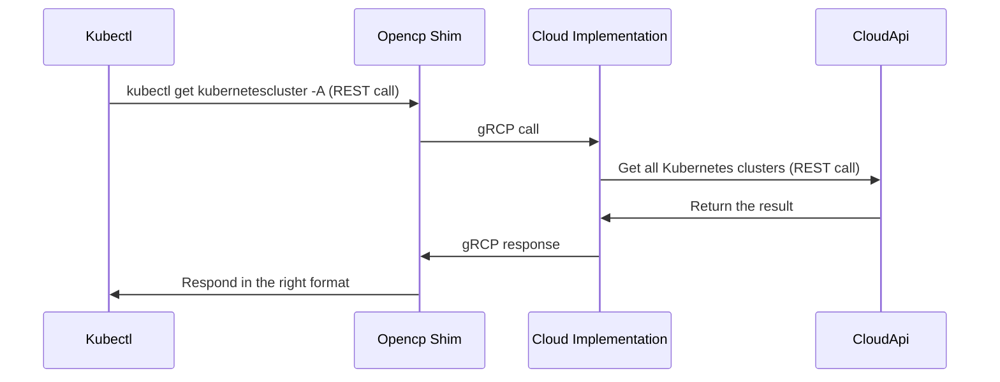

## Introduction

OpenCP (Open Control Plane) is an open source project originally developed by [Civo](www.civo.com) to create a single interface to manage infrastructure using a single tool, kubectl.

### Why OpenCP?

Increasingly, developers face having to learn and update multiple command-line tools on their machines to manage cloud infrastructure, each with their own learning curve and feature set.

Vendors maintaining separate tools need to manage multiple objects (CLI, API versioning, operating system dependencies, etc) for any updates they roll out to their services. Bugfixes across the various cloud service tools can often be difficult to manage across operating systems and platforms, especially with multiple versions of those tools being used by developers concurrently.

OpenCP does away with software update requirements, as resources are entirely API-driven. It is also operating system-agnostic, making use of the existing kubectl binary with nothing else to install or maintain for a user. A cloud provider can maintain OpenCP endpoints alongside their API that map to any resources provided by them. New features can be introduced by new endpoints, or updated specs of existing endpoints in a manner similar to Kubernetes API versioning.

[Kubectl](https://kubernetes.io/docs/reference/kubectl/) is the standard tool for managing Kubernetes resources. It is available for all common operating systems and robustly documented. OpenCP's kubectl compatibility means developers' daily drivers such as [K9s](https://github.com/derailed/k9s) and [Lens](https://github.com/lensapp/lens) are able to be used to manage resources on OpenCP too. As OpenCP objects are managed the same way as any Kubernetes objects, it fits in well with a cloud engineer's workflow.

OpenCP complements existing Infrastructure as Code tools, without needing a separate Kubernetes cluster or other infrastructure to act as the management plane.

OpenCP is useful for platform teams and developers who manage infrastructure with the intention of providing a unified interface through a Kubernetes API Server-like set of endpoints.

In summary, some of the benefits for using OpenCP over other tools are:

- Uses existing kubectl binary, nothing more to install or set up
- Single tool to manage all infrastructure components across cloud/service providers
- No longer necessary to install multiple CLIs from different cloud/service providers
- No software updates required - all API driven
- No separate management plane or cluster required

## Video: OpenCP Introduction

Watch Civo CTO Dinesh Majrekar speaking about OpenCP on the CNCF TAG App Delivery call:

[](https://youtu.be/iuP7b22STqg?t=2264)

## Try OpenCP today

You can test OpenCP out today on Civo by using the [Civo OpenCP Implementation](https://www.github.com/opencontrolplane/civo-opencontrolplane) with your [Civo account](https://www.civo.com/):

### Configuration file

You will find a sample configuration file at [config.md](./config.md). The file contains a KUBECONFIG context that you can edit to include your Civo [API key](https://www.civo.com/docs/account/api-keys).

Once edited, set the KUBECONFIG environment variable to the path to the configuration file. You will then be able to access the Civo API using kubectl commands.

### Specifying a Kubernetes cluster configuration

Referring to the [supported objects](./supported-objects.md), you can create a cluster definition file, `demo-cluster.yaml`. For example:

```bash
apiVersion: opencp.io/v1alpha1
kind: KubernetesCluster
metadata:
  name: demo-cluster
  namespace: Default
spec:
  pools:
    - size: g4s.kube.medium
      count: 3
  version: 1.24.4-k3s1
  cni_plugin: flannel
  cluster_type: k3s
```

### Create cloud provider objects using OpenCP

You can create a cluster using the definition file you edited by applying it to OpenCP the same way as you would apply any Kubernetes object configuration:

```bash
$ kubectl apply -f demo-cluster.yaml
kubernetescluster.opencp.io/demo-cluster created
```

### View resources in a cloud provider region using OpenCP

Resources are available to inspect by type and namespace, where specified as namespaced in the [supported objects](./supported-objects.md). You can list Kubernetes clusters in the current region and all namespaces using the following syntax:

```bash
$ kubectl get kubernetesclusters -n A

NAME              UID                                    POOLS   PUBLIC IP       STATE    AGE
demo-cluster      adafb156-1015-4477-ac6e-8ab67682ad1e   1       74.220.23.185   ACTIVE   2023-02-16T04:39:56Z
```

The specification of resources can be described using `kubectl describe`:

```bash
$ kubectl describe kubernetescluster demo-cluster -n Default

Name:         demo-cluster
Namespace:    Default
Labels:       <none>
Annotations:  <none>
API Version:  opencp.io/v1alpha1
Kind:         KubernetesCluster
Metadata:
  Creation Timestamp:  2023-02-16T04:39:56Z
  UID:                 adafb156-1015-4477-ac6e-8ab67682ad1e
Spec:
  cluster_type:  k3s
  cni_plugin:    flannel
[...]
```

### Delete resources

Deleting a resource you have created using an OpenCP manifest is syntactically the same as deleting an object in Kubernetes:

```bash
$ kubectl delete -f demo-cluster.yaml

kubernetescluster.opencp.io "demo-cluster" deleted
```

## Project Structure

This project has 3 components:

### [opencp-spec](https://github.com/opencontrolplane/opencp-spec)

`opencp-spec` is in charge of keeping the API in go and the client and server generated using `protobuf` files, which will then be used by `opencp-shim` and the provider implementation.

### [opencp-shim](https://github.com/opencontrolplane/opencp-shim)

`opencp-shim` is in charge of interfacing `kubectl` with the provider implementation. This project uses `opencp-spec` to import the `kubectl` compatible go API and create the `gRCP` client, which in turn connects to the server created by the cloud provider.

### Provider Implementation

The provider's implementation imports `opencp-spec` to create the gRCP server, and at the same time communicates with the provider's API to fetch the objects and convert them to `protobuf` objects.

## Open Control Plane Flow

An example OpenCP request flow from a user to a cloud provider to request a list of running clusters.



## Supported Objects

OpenCP supports a number of infrastructure objects. These are detailed in [supported-objects.md](supported-objects.md)

## Contributing

We welcome and appreciate any contributions to OpenCP.

We especially welcome:

- Feedback on the project as a whole from the perspective of a user,
- Contact and encouragement of vendors and cloud providers to implement OpenCP,
- Provider implementations,
- Input and comment on specs,
- Suggestions in the form of KEPs 

For more information on contributing, please see [contributing.md](contributing.md)
 
Thanks for considering a contribution to OpenCP!

## Style Guide

For more information on logos, brand marks, and correct styling of referring to OpenCP, please see [style-guide.md](style-guide.md).

## Maintainers

- [Alejandro J. Nunez Madrazo](https://github.com/alejandrojnm) ([Civo](https://www.civo.com))
- [Saiyam Pathak](https://github.com/saiyam1814) ([Civo](https://www.civo.com))
- [Mark Boost](https://github.com/markboost) ([Civo](https://www.civo.com))
- [Dinesh Majrekar](https://github.com/DMajrekar) ([Civo](https://www.civo.com))
